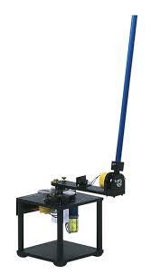
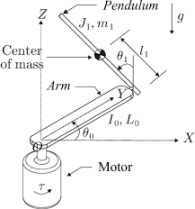
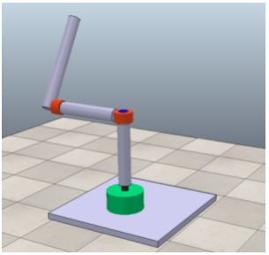
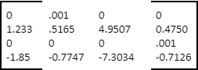

# Futura Pendulum Project

    Control System Design 482-01 
     
    <!--insert img-->
    by 
    Darniece Simon 
    Darren Bohler 
    Mathew Richards 
    Jovany Mondragon

    
    

    

   
    California State University, Chico Department of Mechanical and Mechatronic Engineering and 
    Advanced Manufacturing Chico, Ca 95929.

#### Table Of Contents
- [1. Introduction](#1-introduction)
- [2. Objectives](#2-objectives)
- [3. Modeling](#3-modeling)
    - [3a. Linear Space Model](#3a-linear-space-model)
- [4. Sensor Calibration](#4-sensor-calibration)
- [5. Controller Design and Simulations](#5-controller-design-and-simulations)
    - [5a. Controller within MATLAB](#5a-controller-within-matlab)
    - [5b. Interface within MATLAB](#5b-interface-within-matlab)
- [6. Results](#6-results)
- [7. Reference](#7-references)

## 1. Introduction
The Furuta pendulum has been in use since 1992, when it was invented by Katsuhisa Furuta. The Furuta pendulum, or the rotational inverted pendulum consists of a driven arm rotating in the horizontal plane. In the following report is the design, implementation, and analyzation through state space representation of the Furuta pendulum, Figure 1 provides a depiction of the analyzed. The system will become balanced in real time using an engineered simulation, which is connected through a state space representation equation

  
    
     
    Figure 1
    

## 2. Objectives
- Produce a controller that balances a rotary inverted pendulum in its upright position starting from its downright position.
- When powered on the pendulum must stay upright (in the vertical axis). When the pendulum is knocked down or moved it must be able to return to its upright position by only using a motor that rotates in the horizontal axis.
- simulate the system in Coppelia while being connected to MATLAB
- Provide the mathematical model of the system
- If the system contains hardware, the design of hardware should consist the necessary architectural explanations such as hardware and software relationships.

## 3. Modeling
The system consists of 2 masses, arm 1 m in the horizontal plane, and arm 2 the pendulum, which rotates freely in the vertical plane. In addition to a link connecting arm 1 and the pendulum, that is fixed, Figure 2 depicts a DC motor applying torque to arm 1 m, which moves horizontally then controls the pendulum so it may remain in the upright position. The torque t is a critical component used in the feedback control system, which is done using a state-space model. The angular rotation from arm 1, 0is measured in the horizontal plane, where it is assumed that the counter clockwise direction is considered to be positive. The angular rotation from the pendulum 1is measured in the vertical plane, where it is also to be assumed that the counter clockwise direction is positive. The system is stable when the pendulum arm is in the upright vertical position 1=n*2𝜋.

  
    
     
    Figure 2
    

### 3a. Linear Space Model
When deriving the system dynamics, assumptions must be considered. Firstly, the motor and arm 1 are rigidly coupled and inelastic. In addition, the coordinate axes of arms 1 and 2 are the principal axes of inertia. However, the motor rotor inertia is also assumed to be negligible, so the viscous damping is the only one to be considered.      
State-space equation is used as a mathematical model that represents the pendulum’s physical system. The pendulum system is represented by a set of inputs, outputs, and state variables related by first-order differential equations. Eq 1 and Eq 2 can be found below representing the inputs u  and outputs x, as well as the state space variable vector state x of the pendulum system. 

  
    
     
    

While the state matrix A, input matrix B, output matrix C, and the forward matrix D can be solved using dynamic systems of equations found within Eq 1 and Eq 2. Table 1 below depicts the results for each state-space variable, in addition to the open loop pole coordinates. 

    Table 1 Parameter Results 
    
     
    

## 4. Sensor Calibration
The pendulum has an encoder which is traditionally used for calibration purposes. However, in the following report, Coppelia Sim, a computer application, is used as a live calibration device through Matlab code. The four state variables are directly read through the CoppeliaSim remote API, since the API provides functions to determine the angular position and velocity of any object in the scene.

## 5. Controller Design and Simulations

### 5a. Controller within MATLAB

    
Expand for code

    
    function T = controller(theta0, dtheta0, theta1, dtheta1)
    L0 = 0.12;
    L1 = 0.12;
    g = 9.81;
    m0 = 0.10;
    m1 = 0.10;
    Lmass = 0.5*L1;
    I = (1/3)*m0*L0^2;
    J = (1/12)*m1*L1^2;
    A = [0 1                           0                         0;
         0 0    -g*m1^2*Lmass^2*L0/(I*(J+m1*Lmass^2)+J*m1*L0^2)  0;
         0 0                           0                         1;
         0 0 (I+m1*L0^2)*m1*Lmass*g/(I*(J+m1*Lmass^2)+J*m1*L0^2) 0];
    B = [                      0;
        (J+m1*Lmass^2)/(I*(J+m1*Lmass^2)+J*m1*L0^2);
                               0;
        -(m1*Lmass*L0)/(I*(J+m1*Lmass^2)+J*m1*L0^2)];

    p1 = -16+1j;
    p2 = -16-1j;
    p3 = -16.7417;
    p4 = -160.7417;

    K = place(A,B,[p1 p2 p3 p4]);
    states = [theta0, dtheta0, theta1, dtheta1];
    T = K*states';    

### 5b. Interface within MATLAB

    
Expand for code

    
    %initialize API and connect to server (CoppeliaSim) in synchronous mode
    sim=remApi('remoteApi');
    sim.simxFinish(-1);
    clientID=sim.simxStart('127.0.0.1',19999,true,true,5000,5);
    %Set synchronous mode so that model will wait for MATLAB script
    sim.simxSynchronous(clientID,true);

    %get object handles for joint1 (rotor arm) and joint2 (pendulum arm).
    [~, rot_joint] = sim.simxGetObjectHandle(clientID,'rotor_joint',sim.simx_opmode_blocking);
    [~, rot_arm] = sim.simxGetObjectHandle(clientID,'rotor_arm',sim.simx_opmode_blocking);
    [~, pend_joint] = sim.simxGetObjectHandle(clientID,'pendulum_joint',sim.simx_opmode_blocking);
    [~, pend_arm] = sim.simxGetObjectHandle(clientID,'pendulum_arm',sim.simx_opmode_blocking);
    sim.simxStartSimulation(clientID,sim.simx_opmode_blocking);
    %This line is for debugging, to test the model's response
    %returnCode = sim.simxSetJointMaxForce(clientID,rot_joint,50,sim.simx_opmode_oneshot);

    %Run 100 steps of simulation in Coppelia
    for i=1:100
        %Get position and velocity of the rotator joint and position and
        %velocity of the pendulum joint. These are the 4 state variables.
        [~,theta0] = sim.simxGetJointPosition(clientID,rot_joint,sim.simx_opmode_blocking);    
        [~,~,rot_arm_vel] = sim.simxGetObjectVelocity(clientID,rot_arm,sim.simx_opmode_blocking);
        [~,theta1] = sim.simxGetJointPosition(clientID,pend_joint,sim.simx_opmode_blocking);    
        [~,~,pend_arm_vel] = sim.simxGetObjectVelocity(clientID,pend_arm,sim.simx_opmode_blocking);
        %extract the meaningful velocity measurements (rot_arm_vel and 
        %pend_arm_vel are 1x3 arrays of 3D coordinates). 
        dtheta0 = rot_arm_vel(3);
        dtheta1 = pend_arm_vel(1);
    
        disp([theta0, dtheta0, theta1, dtheta1])
        torque = controller(theta0,dtheta0,theta1,dtheta1);
        %To implement torque control in Coppelia, an arbitrary large target
        %velocity is chosen and the maximum force allowed is the desired
        %torque. The direction of the large velocity must be changed to
        %simulate negate torque. This is the reason for the if/else logic.
        if(torque>0)
            returnCode = sim.simxSetJointTargetVelocity(clientID,rot_joint,1e5,sim.simx_opmode_blocking);
            returnCode = sim.simxSetJointMaxForce(clientID,rot_joint,torque,sim.simx_opmode_blocking);
        
        else
            returnCode = sim.simxSetJointTargetVelocity(clientID,rot_joint,-1e5,sim.simx_opmode_blocking);
            returnCode = sim.simxSetJointMaxForce(clientID,rot_joint,-torque,sim.simx_opmode_blocking);
        end
        %Trigger the next simulation step
        sim.simxSynchronousTrigger(clientID);
    end
    %After 100 steps, pause the simulation and disconnect from the API
    sim.simxPauseSimulation(clientID,sim.simx_opmode_blocking);
    sim.simxFinish(clientID);
    sim.delete();

Figure 3 provides a representation of the physical pendulum system model used as a constant calibration device.

  
    
     
    Figure 3
    

## 6. Results

Figure 4 provides the calculated parameters after adding the full state feedback controller K. The output parameters are negative, meaning the system is stable.

  
    
     
    Figure 4
    

The eigenvalues found from matrix A can be found depicted below with in Figure 5, it is shown going to zero, thus showing the systems stability.

  
    
     
    Figure 5
    

## 7. References
Duart, J. L., et al. "Dynamic modeling and simulation of a rotational inverted pendulum." Journal of Physics: Conference Series. Vol. 792. No. 1. IOP Publishing, 2017. 

Lbeatu. “Lbeatu/Furuta-Pendulum-Simulink-Model-GUI-on-MATLAB-2017b.” GitHub, https://github.com/lbeatu/Furuta-Pendulum-Simulink-Model-GUI-on-MATLAB-2017b. 

Levis, Michel. “What Is Open Architecture?” Quanser, 11 Feb. 2020, www.quanser.com/blog/open-architecture-platforms-for-teaching-research/.  

pab47. “pab47/pab47.Github.io.” GitHub, 2020, https://github.com/pab47/pab47.github.io/tree/master/robotics/f20. 

“Regular API Reference.” Regular API Reference, Coppelia Robotics, https://coppeliarobotics.com/helpFiles/en/apiFunctions.htm.  

“Rotary Inverted Pendulum.” Quanser, 20 Apr. 2021, www.quanser.com/products/rotary-inverted-pendulum/#overview.  

“Rotary Pendulum Workbook Instructor Version.” Quanser, 2011, https://nps.edu/documents/105873337/0/Rotary+Pendulum+Workbook+_Instructor_.pdf/e17aa0a2-5f98-4957-b4a7-e80f0f52a4a3?t=1436282377000.  

“Rotary Servo Base Unit.” Quanser, 20 Apr. 2021, www.quanser.com/products/rotary-servo-base-unit/. 

